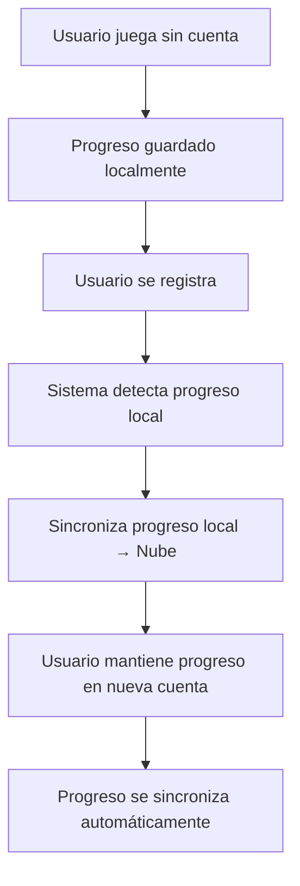

# 📝 Guía de Registro con Progreso Local

## 📋 Resumen

Cuando un usuario se registra en Pathly, el sistema **automáticamente sincroniza** el progreso local existente con la nueva cuenta, asegurando que no pierda su progreso al crear una cuenta.

## 🔄 Flujo de Registro con Progreso

### **¿Cómo Funciona?**

```typescript
// En auth.ts - Registro con sincronización automática
async register(credentials: RegisterCredentials): Promise<User> {
    // 1. Crear usuario en Firebase Auth
    const userCredential = await createUserWithEmailAndPassword(auth, email, password);
    
    // 2. Crear datos del usuario en Firestore
    await this.createUserData(user);
    
    // 3. ✅ Sincronizar progreso local con la nueva cuenta
    await syncOnRegister(user.uid);
    
    return user;
}
```

### **Proceso Detallado**

1. **Usuario tiene progreso local** (sin cuenta)
2. **Usuario se registra** con email y contraseña
3. **Sistema detecta progreso local** automáticamente
4. **Sincroniza progreso local** → Nube (nueva cuenta)
5. **Usuario mantiene todo su progreso** en la nueva cuenta

## 📊 Sincronización en el Registro

### **Función syncOnRegister**

```typescript
async syncOnRegister(userId: string): Promise<void> {
    // Obtener progreso local existente
    const localProgress = await getProgress();
    const lastLevelPlayed = await getLastLevelPlayed();

    // Crear progreso en la nube con datos locales
    const cloudProgress: CloudProgress = {
        completedLevels: Array.from(localProgress.completedLevels),
        lastPlayedLevel: lastLevelPlayed,
        lastPlayedAt: localProgress.lastPlayedAt,
        lastSyncAt: Date.now(),
        totalLevelsCompleted: localProgress.completedLevels.size,
    };

    // Guardar en Firestore
    await updateDoc(userRef, { progress: cloudProgress });
}
```

### **Logs de Sincronización**

```typescript
📊 Progreso local encontrado:
- Niveles completados: 5
- Último nivel jugado: level_21
- Última actividad: 15/12/2024, 14:30:25

✅ Progreso local sincronizado con nueva cuenta:
- Niveles transferidos: 5
- Nivel más alto: 20
- Total completados: 5
```

## 📱 Casos de Uso

### **Caso 1: Usuario Nuevo sin Progreso**

1. **Usuario instala la app** → Progreso local: vacío
2. **Usuario se registra** → Progreso en nube: vacío
3. **Usuario comienza a jugar** → Progreso se guarda local y en nube

### **Caso 2: Usuario con Progreso Local**

1. **Usuario juega sin cuenta** → Progreso local: nivel 15
2. **Usuario se registra** → Progreso local → Nube (nivel 15)
3. **Usuario continúa jugando** → Progreso sincronizado automáticamente

### **Caso 3: Progreso No Secuencial**

1. **Usuario completa niveles** → `['level_1', 'level_2', 'level_15', 'level_20']`
2. **Usuario se registra** → Todos los niveles se transfieren
3. **Nivel más alto preservado** → Nivel 20

## 🧪 Testing del Registro

### **Script de Prueba**

```bash
# Probar registro con progreso local
node scripts/test-register-with-local-progress.js
```

### **Verificación Manual**

1. **Jugar sin cuenta** hasta completar algunos niveles
2. **Registrarse** con email y contraseña
3. **Verificar** que el progreso se mantiene
4. **Continuar jugando** para confirmar sincronización

### **Logs Esperados**

```typescript
🧪 Probando registro con progreso local existente...

1️⃣ Simulando progreso local existente...
📊 Progreso local simulado:
- Niveles completados: ['level_1', 'level_2', 'level_3', 'level_15', 'level_20']
- Último nivel jugado: level_21
- Nivel más alto: 20

2️⃣ Registrando nueva cuenta...
- Email: test_1234567890@example.com
- Nombre: Usuario Test
✅ Cuenta creada exitosamente: abc123def456

3️⃣ Verificando sincronización de progreso...
📊 Progreso en la nube después del registro:
- Niveles completados: ['level_1', 'level_2', 'level_3', 'level_15', 'level_20']
- Último nivel jugado: level_21
- Total completados: 5
- Nivel más alto: 20

✅ Sincronización exitosa: Progreso local transferido correctamente
```

## 🔧 Configuración Técnica

### **Dependencias**

```typescript
// En auth.ts
import { syncOnRegister } from './syncService';

// En syncService.ts
import { getProgress, getLastLevelPlayed } from './storage';
import { doc, updateDoc } from 'firebase/firestore';
```

### **Estructura de Datos**

```typescript
interface CloudProgress {
    completedLevels: string[];      // Array de IDs de niveles
    lastPlayedLevel: string | null; // Último nivel jugado
    lastPlayedAt: number;           // Timestamp de última actividad
    lastSyncAt: number;             // Timestamp de última sincronización
    totalLevelsCompleted: number;   // Total de niveles completados
}
```

## 🚀 Beneficios del Sistema

### **Para el Usuario**

✅ **No pierde progreso** al registrarse
✅ **Experiencia continua** sin interrupciones
✅ **Progreso preservado** automáticamente
✅ **Sincronización transparente** sin intervención manual

### **Para el Desarrollador**

✅ **Lógica automática** - No requiere código adicional
✅ **Manejo de errores** robusto
✅ **Logs detallados** para debugging
✅ **Escalabilidad** - Funciona con cualquier cantidad de niveles

## 🔍 Solución de Problemas

### **Problema: Progreso no se sincroniza al registrar**

**Causas posibles:**
- Error en AsyncStorage
- Error de red al conectar con Firestore
- Progreso local corrupto

**Solución:**
```typescript
// Verificar progreso local
const progress = await getProgress();
console.log('Progreso local:', progress);

// Verificar conexión a Firestore
const userRef = doc(db, 'users', userId);
const userDoc = await getDoc(userRef);
```

### **Problema: Progreso parcial sincronizado**

**Causa**: Error durante la transferencia
**Solución**: Verificar logs de sincronización y reintentar

### **Problema: Niveles duplicados**

**Causa**: Sincronización múltiple
**Solución**: El sistema usa Set para evitar duplicados automáticamente

## ✅ Checklist de Verificación

- [ ] Progreso local se detecta correctamente
- [ ] Sincronización automática al registrar
- [ ] Todos los niveles se transfieren
- [ ] Nivel más alto se preserva
- [ ] Logs muestran transferencia exitosa
- [ ] Progreso continúa sincronizándose después del registro
- [ ] Manejo de errores funciona correctamente

## 📞 Soporte

Si tienes problemas con el registro y sincronización:

1. **Verificar logs** de registro y sincronización
2. **Ejecutar script** de prueba
3. **Revisar progreso local** antes del registro
4. **Contactar soporte** con logs completos

## 🔄 Flujo Completo del Sistema



**El sistema garantiza que ningún usuario pierda su progreso al crear una cuenta, proporcionando una experiencia fluida y sin interrupciones.** 